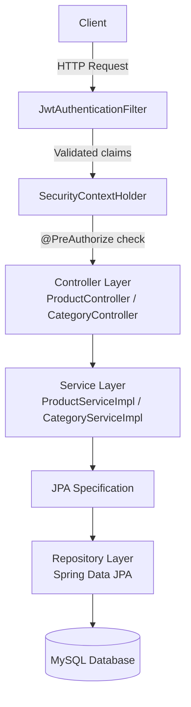
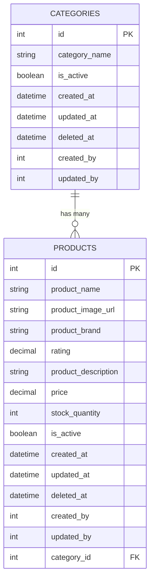
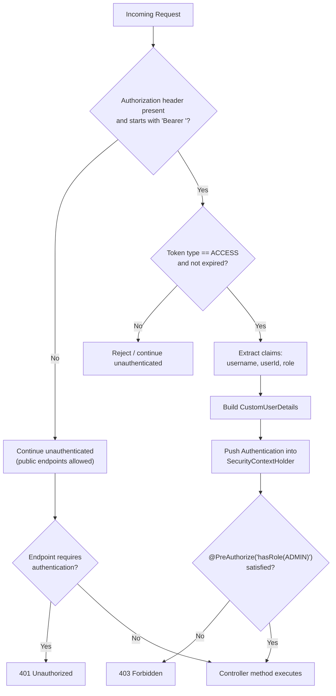
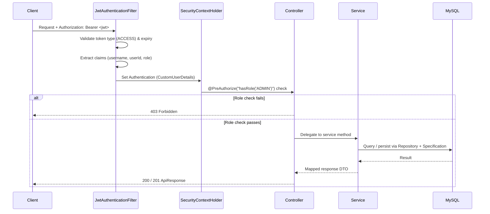
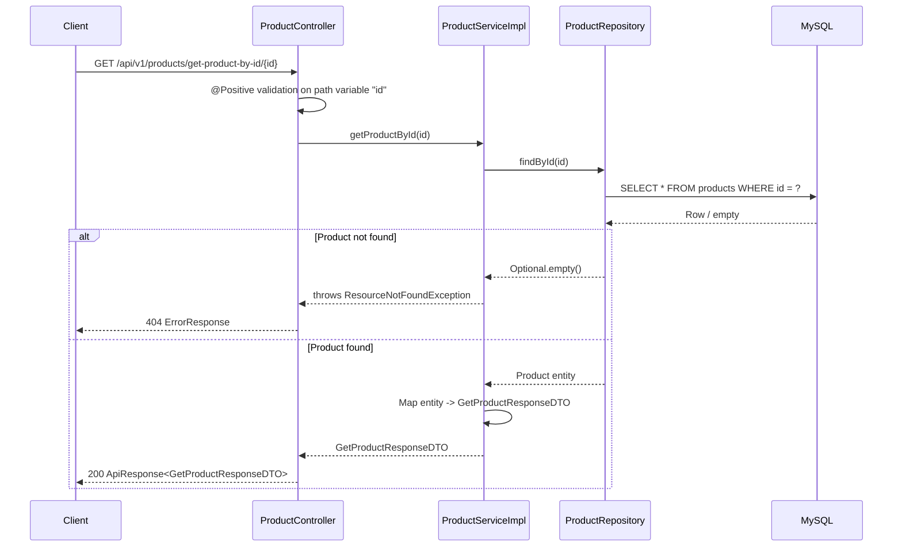

# NovaCart Product Service

A production-style Spring Boot microservice for managing the catalog layer of the NovaCart e-commerce platform. This service exposes REST endpoints for product and category operations, enforces JWT-based access control, and uses Flyway-managed MySQL schema migrations.

---

# Project Overview

The Product Service is responsible for the catalog domain within the broader e-commerce ecosystem. In its current implementation, it handles:

- Product lifecycle management
- Category lifecycle management
- Search, filtering, pagination, and sorting
- Soft delete and restore workflows
- Admin-only mutation endpoints protected by JWT role checks
- Swagger-based API documentation

This service is not currently implemented as a distributed microservice that calls other services. The codebase does not contain inter-service communication, service discovery, or event-driven integration. Instead, it acts as an independently deployable REST service with a relational database backend.

---

# Key Features

## Product Management

- Create products
- Retrieve a single product by ID
- Retrieve all active products with pagination and sorting
- Retrieve deleted products for admin workflows
- Update product details via partial update
- Soft delete and restore products
- Permanently remove products

## Category Management

- Create categories
- Retrieve a single category by ID
- Retrieve all active categories with pagination and sorting
- Retrieve deleted categories for admin workflows
- Update category details
- Soft delete and restore categories
- Permanently remove categories

## Security

- JWT authentication filter
- Role-based authorization for admin operations
- Stateless session management
- Public read access for product and category browsing endpoints

## Validation

- Request validation using Jakarta Validation
- Path variable and query parameter validation
- DTO-level constraints for create and update payloads

## Pagination, Sorting, and Filtering

- Page and size parameters
- Sort direction and sort field support
- JPA Specifications for dynamic filtering

## Soft Delete

- Soft delete implemented using `deletedAt` and `isActive`
- Separate active and deleted views
- Restore support for deleted rows

## Auditing

- Audit timestamp fields via JPA lifecycle callbacks
- Created/updated/deleted timestamps
- Created/updated by identifiers are stored in the base entity

## Swagger

- OpenAPI documentation generated through springdoc-openapi
- Swagger UI available at runtime

## Flyway

- SQL migrations for schema creation and seed data
- Database evolution handled automatically by Flyway

## Docker

- Docker Compose configuration for running the service container

## Logging

- Structured service-layer logging with SLF4J

## Exception Handling

- Global exception handler for validation, not-found, duplicate-resource, and DB constraint failures

## SonarQube and CI

- SonarQube analysis configuration in Gradle
- GitHub Actions workflow for build, test, coverage, and Sonar scanning

---

# Tech Stack

| Layer | Technology | Notes |
| --- | --- | --- |
| Language | Java 21 | Build and runtime target |
| Framework | Spring Boot 4.1.0 | Main application framework |
| Web | Spring Web MVC | REST controller implementation |
| Data | Spring Data JPA | Repository layer and persistence |
| Validation | Jakarta Validation | DTO validation |
| Security | Spring Security | JWT filter and authorization |
| Authentication | JWT (jjwt 0.12.6) | Token parsing and validation only |
| Database | MySQL | Primary data store |
| Migrations | Flyway | SQL-based migration strategy |
| Documentation | springdoc-openapi 3.0.1 | Swagger UI and OpenAPI docs |
| Build Tool | Gradle | Wrapper included |
| Testing | JUnit 5, Spring Test | Unit and integration-oriented test support |
| Coverage | JaCoCo | Test coverage reporting |
| Code Quality | SonarQube | Gradle integration |
| CI/CD | GitHub Actions | Self-hosted runner workflow |
| Containerization | Docker Compose | Service containerization |
| Boilerplate Reduction | Lombok | DTO/entity/service simplification |

---

# Architecture

This project follows a layered Spring Boot architecture:

1. Controller Layer
   - Exposes REST endpoints for products and categories
   - Handles input validation and delegates to services

2. Service Layer
   - Contains business logic for create, update, delete, restore, and query flows
   - Applies pagination, sorting, and specification-based filtering
   - Enforces business rules such as duplicate-name checks

3. Repository Layer
   - Uses Spring Data JPA repositories
   - Supports JPA Specifications for dynamic query construction

4. Database Layer
   - MySQL tables for categories and products
   - Flyway migrations manage schema creation and seed data

## Request Flow

```text
Client
  ↓
Controller
  ↓
Service
  ↓
Repository / Specification
  ↓
MySQL Database
```

## Security Flow

```text
Client
  ↓
JWT Access Token in Authorization header
  ↓
JwtAuthenticationFilter
  ↓
SecurityContextHolder
  ↓
@PreAuthorize checks
  ↓
Controller
```

## Package Responsibilities

- `controller`: REST endpoints
- `service`: domain logic and transaction boundaries
- `repository`: JPA access layer
- `entity`: persistence model
- `dto`: request/response contracts
- `mapper`: entity/DTO transformation
- `specification`: dynamic filtering logic
- `security`: JWT parsing and filter handling
- `exception`: centralized error responses
- `config`: properties and security configuration

---

# Project Structure

```text
src/
├── main/
│   ├── java/
│   │   └── com/test/product_service/
│   │       ├── config/
│   │       ├── controller/
│   │       ├── dto/
│   │       ├── entity/
│   │       ├── exception/
│   │       ├── mapper/
│   │       ├── repository/
│   │       ├── security/
│   │       ├── service/
│   │       ├── specification/
│   │       └── uttils/
│   └── resources/
│       ├── application.properties
│       └── db/migration/
└── test/
    └── java/com/test/product_service/
```

### Important Packages

- `controller`: Product and category REST APIs
- `service.impl`: Concrete service implementations
- `entity`: `Product`, `Category`, and `AuditableEntity`
- `specification`: reusable JPA Specification builders for search behavior
- `security`: JWT filter and authentication helpers
- `exception`: centralized exception handling and custom error types

---

# Security

Security is implemented with Spring Security and a custom JWT authentication filter.

## Implemented Security Features

- Stateless session management via `SessionCreationPolicy.STATELESS`
- JWT validation in a custom filter
- Authentication context population through `SecurityContextHolder`
- Method-level authorization with `@PreAuthorize`
- Admin-only mutation endpoints for product and category management
- OpenAPI and Swagger endpoints permitted publicly
- Public read endpoints for products and categories

## How JWT Authentication Works

The service validates incoming bearer tokens in the `Authorization` header.

The flow is:

1. The request is intercepted by `JwtAuthenticationFilter`
2. The filter checks whether the header is present and starts with `Bearer `
3. The token is validated for:
   - correct token type (`ACCESS`)
   - non-expired status
4. Claims are extracted from the JWT:
   - username/email
   - user ID
   - role
5. A `CustomUserDetails` object is created
6. The authentication object is pushed into `SecurityContextHolder`
7. `@PreAuthorize` evaluates the admin role requirement

## Important Note

This service does not generate JWTs. It only validates tokens that are issued by an authentication service or trusted identity provider.

## Public vs Protected Endpoints

### Public Endpoints

- Product browsing endpoints
- Category browsing endpoints
- Swagger UI and OpenAPI docs

### Admin-Protected Endpoints

- Create product
- Update product
- Soft delete product
- Restore product
- Permanently delete product
- Create category
- Update category
- Soft delete category
- Restore category
- Permanently delete category
- Retrieve deleted records

---

# Database Design

The service uses MySQL with Flyway-managed schema evolution.

## Tables

### `categories`

Stores category metadata and lifecycle state.

Columns include:

- `id`
- `category_name`
- `is_active`
- `created_at`
- `updated_at`
- `deleted_at`
- `created_by`
- `updated_by`

### `products`

Stores product data and links each product to a category.

Columns include:

- `id`
- `product_name`
- `product_image_url`
- `product_brand`
- `rating`
- `product_description`
- `price`
- `stock_quantity`
- `is_active`
- `created_at`
- `updated_at`
- `deleted_at`
- `created_by`
- `updated_by`
- `category_id`

## Relationships

- One category can have many products
- Each product belongs to exactly one category
- The relationship is enforced through a foreign key from `products.category_id` to `categories.id`

## Soft Delete

Soft delete is implemented by setting:

- `deletedAt` to the current timestamp
- `isActive` to `false`

Deleted records remain in the database and can be restored later.

## Auditing Design

The shared base class `AuditableEntity` provides:

- `createdAt`
- `updatedAt`
- `deletedAt`
- `createdBy`
- `updatedBy`

The timestamps are populated automatically through JPA lifecycle hooks.

---

# API Documentation

Swagger UI is available when the application is running at `http://localhost:8081/swagger-ui/index.html`. All endpoints below are documented directly from the implemented controllers, DTOs, and the global exception handler.

## API Status Legend

 Endpoint is accessible without a token (`permitAll` in `SecurityConfig`).

 Endpoint requires a valid JWT **and** `@PreAuthorize("hasRole('ADMIN')")`.

 A valid, non-expired `ACCESS` token must be sent in the `Authorization: Bearer <token>` header.

> **Note:** This service does not issue JWTs — it only validates tokens issued by an external authentication/identity service. There is no `/login` endpoint in this codebase.

---

## Architecture Diagram



## Entity Relationship Diagram



## JWT Authentication Flowchart



## Sequence Diagram — Authenticated (JWT) Request Flow

> There is no login endpoint in this service; the token is assumed to already be issued by an external identity provider.



## Sequence Diagram — Product Request Flow (`GET /get-product-by-id/{id}`)



---

## Common Response Envelope

Every endpoint (success and error) returns responses wrapped as follows.

**`ApiResponse<T>`**

```json
{
  "success": true,
  "message": "string",
  "data": {}
}
```

**`PageResponse<T>`** (used as `data` for all paginated list endpoints)

```json
{
  "content": [],
  "pageNumber": 0,
  "pageSize": 10,
  "totalElements": 0,
  "totalPages": 0,
  "numberOfElements": 0,
  "first": true,
  "last": true
}
```

**`ErrorResponse`** (returned by the global `@RestControllerAdvice` for every error case)

```json
{
  "timestamp": "2026-08-03T10:15:30",
  "status": "BAD_REQUEST",
  "error": "VALIDATION_ERROR",
  "message": "string",
  "path": "/api/v1/products/add-product"
}
```

| Exception | HTTP Status | `error` value | `message` value |
| --- | --- | --- | --- |
| `ResourceNotFoundException` | 404 | custom error code | custom message |
| `DuplicateResourceException` | 409 | custom error code | custom message |
| `MethodArgumentNotValidException` (`@Valid` body failures) | 400 | `VALIDATION_ERROR` | `field: message` pairs joined by `, ` |
| `ConstraintViolationException` (`@Positive`/`@PositiveOrZero` on path/query params) | 400 | `VALIDATION_ERROR` | raw constraint violation message |
| `DataIntegrityViolationException` | 400 | `DATABASE_CONSTRAINT_VIOLATION` | `"DataIntegrity Violation"` |
| `MethodArgumentTypeMismatchException` (invalid enum, e.g. bad `sortBy`) | 400 | `INVALID_PARAMETER` | `"Invalid value for parameter: {name}"` (+ allowed enum values) |
| Generic `Exception` | 500 | `SOMETHING_WENT_WRONG` | `ex.getMessage()` |

---

## Product APIs

| # | Method | Endpoint | Access |
| --- | --- | --- | --- |
| 1 | `GET` | `/api/v1/products/get-all-products` |  |
| 2 | `GET` | `/api/v1/products/get-product-by-id/{id}` |  |
| 3 | `POST` | `/api/v1/products/add-product` |  |
| 4 | `DELETE` | `/api/v1/products/remove-product/{id}/permanent` |  |
| 5 | `DELETE` | `/api/v1/products/remove-product/{id}` |  |
| 6 | `PATCH` | `/api/v1/products/restore-product/{id}` |  |
| 7 | `GET` | `/api/v1/products/get-deleted-product` |  |
| 8 | `GET` | `/api/v1/products/get-deleted-product-by-id/{id}` |  |
| 9 | `PATCH` | `/api/v1/products/update-product-by-id/{id}` |  |

<details>
<summary><strong>GET /api/v1/products/get-all-products</strong></summary>

### Description

Returns a paginated, sortable, filterable list of **active** products.

### Authentication


None required.

### Request Parameters

**Path Variables:** none

**Query Parameters** (bound via `@ModelAttribute SearchProductRequestDTO` + pagination/sort params)

| Param | Type | Default | Notes |
| --- | --- | --- | --- |
| `productName` | String | — | Optional filter |
| `productBrand` | String | — | Optional filter |
| `categoryId` | Integer | — | Optional filter |
| `minPrice` | BigDecimal | — | Optional filter |
| `maxPrice` | BigDecimal | — | Optional filter |
| `minRating` | BigDecimal | — | Optional filter |
| `inStock` | Boolean | — | Optional filter |
| `isActive` | Boolean | — | Optional filter |
| `pageNumber` | int | `0` | `@PositiveOrZero` |
| `size` | int | `10` | `@Positive` |
| `sortBy` | enum | `ID` | `ID`, `PRICE`, `NAME`, `RATING`, `CREATED_AT` |
| `direction` | enum | `ASC` | `ASC`, `DESC` |

### Request Body

None.

### Success Response

`200 OK`

```json
{
  "success": true,
  "message": "Products fetched successfully",
  "data": {
    "content": [
      {
        "id": 1,
        "productName": "string",
        "productImageUrl": "string",
        "productBrand": "string",
        "rating": 4.5,
        "productDescription": "string",
        "price": 999.99,
        "stockQuantity": 25,
        "isActive": true,
        "createdBy": 1,
        "updatedBy": 1,
        "createdAt": "2026-08-01T10:00:00",
        "updatedAt": "2026-08-01T10:00:00",
        "deletedAt": null,
        "categoryId": 1,
        "categoryName": "string"
      }
    ],
    "pageNumber": 0,
    "pageSize": 10,
    "totalElements": 1,
    "totalPages": 1,
    "numberOfElements": 1,
    "first": true,
    "last": true
  }
}
```

### Error Responses

| Status | Cause |
| --- | --- |
| `400` | Invalid `pageNumber`/`size` (`ConstraintViolationException`) or invalid `sortBy`/`direction` enum value (`MethodArgumentTypeMismatchException`) |
| `500` | Unexpected server error |

```json
{
  "timestamp": "2026-08-03T10:15:30",
  "status": "BAD_REQUEST",
  "error": "INVALID_PARAMETER",
  "message": "Invalid value for parameter: sortBy. Allowed values: [ID, PRICE, NAME, RATING, CREATED_AT]",
  "path": "/api/v1/products/get-all-products"
}
```

### Validation Rules

- `pageNumber` must be `>= 0`
- `size` must be `> 0`
- `sortBy` must be one of `ID`, `PRICE`, `NAME`, `RATING`, `CREATED_AT`
- `direction` must be one of `ASC`, `DESC`

### Example Usage

```text
GET /api/v1/products/get-all-products?pageNumber=0&size=10&sortBy=PRICE&direction=DESC&minPrice=100&isActive=true
```

### Notes

Only active products are returned by this endpoint; deleted products are retrieved via the dedicated admin-only endpoints below. Filtering is implemented with JPA Specifications, so all query parameters are optional and combinable.

</details>

<details>
<summary><strong>GET /api/v1/products/get-product-by-id/{id}</strong></summary>

### Description

Fetches a single active product by its ID.

### Authentication


None required.

### Request Parameters

**Path Variables**

| Variable | Type | Constraint |
| --- | --- | --- |
| `id` | Integer | `@Positive` (must be `> 0`) |

**Query Parameters:** none

### Request Body

None.

### Success Response

`200 OK`

```json
{
  "success": true,
  "message": "Product fetched successfully",
  "data": {
    "id": 1,
    "productName": "string",
    "productImageUrl": "string",
    "productBrand": "string",
    "rating": 4.5,
    "productDescription": "string",
    "price": 999.99,
    "stockQuantity": 25,
    "isActive": true,
    "createdBy": 1,
    "updatedBy": 1,
    "createdAt": "2026-08-01T10:00:00",
    "updatedAt": "2026-08-01T10:00:00",
    "deletedAt": null,
    "categoryId": 1,
    "categoryName": "string"
  }
}
```

### Error Responses

| Status | Cause |
| --- | --- |
| `400` | `id <= 0` (`ConstraintViolationException`) |
| `404` | No product with the given ID (`ResourceNotFoundException`) |

```json
{
  "timestamp": "2026-08-03T10:15:30",
  "status": "NOT_FOUND",
  "error": "PRODUCT_NOT_FOUND",
  "message": "Product not found with id: 1",
  "path": "/api/v1/products/get-product-by-id/1"
}
```

### Validation Rules

- `id` must be greater than `0`

### Example Usage

```text
GET /api/v1/products/get-product-by-id/1
```

### Notes

Returns only active (non soft-deleted) products.

</details>

<details>
<summary><strong>POST /api/v1/products/add-product</strong></summary>

### Description

Creates a new product.

### Authentication

Bearer JWT

Role:
ROLE_ADMIN

### Request Parameters

**Path Variables:** none

**Query Parameters:** none

### Request Body

`AddProductRequestDTO`

```json
{
  "productName": "string",
  "productImageUrl": "string",
  "productBrand": "string",
  "productDescription": "string",
  "price": 999.99,
  "stockQuantity": 25,
  "isActive": true,
  "categoryId": 1
}
```

### Success Response

`201 Created`

```json
{
  "success": true,
  "message": "Product created successfully",
  "data": 1
}
```

### Error Responses

| Status | Cause |
| --- | --- |
| `400` | DTO validation failure (`MethodArgumentNotValidException`) |
| `401` | Missing/invalid JWT |
| `403` | Authenticated but not `ROLE_ADMIN` |
| `404` | `categoryId` does not exist (`ResourceNotFoundException`) |
| `409` | Duplicate product (`DuplicateResourceException`) |

```json
{
  "timestamp": "2026-08-03T10:15:30",
  "status": "BAD_REQUEST",
  "error": "VALIDATION_ERROR",
  "message": "productName: Product name is required, price: Price must be greater than 0",
  "path": "/api/v1/products/add-product"
}
```

### Validation Rules

- `productName`: `@NotBlank`, `2`–`100` characters
- `productImageUrl`: optional, max `500` characters
- `productBrand`: optional, max `100` characters
- `productDescription`: optional, max `2000` characters
- `price`: `@NotNull`, `@Positive`, up to `8` integer digits and `2` decimal places
- `stockQuantity`: `@NotNull`, `@PositiveOrZero`
- `isActive`: `@NotNull`
- `categoryId`: `@NotNull`, `@Positive`

### Example Usage

```bash
curl -X POST http://localhost:8081/api/v1/products/add-product \
  -H "Authorization: Bearer <jwt>" \
  -H "Content-Type: application/json" \
  -d '{"productName":"Wireless Mouse","price":999.99,"stockQuantity":25,"isActive":true,"categoryId":1}'
```

### Notes

Returns the newly created product's ID as `data`, not the full product payload.

</details>

<details>
<summary><strong>DELETE /api/v1/products/remove-product/{id}/permanent</strong></summary>

### Description

Permanently (hard) deletes a product, bypassing soft delete.

### Authentication

Bearer JWT

Role:
ROLE_ADMIN

### Request Parameters

**Path Variables**

| Variable | Type | Constraint |
| --- | --- | --- |
| `id` | Integer | `@Positive` |

**Query Parameters:** none

### Request Body

None.

### Success Response

`200 OK`

```json
{
  "success": true,
  "message": "Product permanently deleted successfully",
  "data": 1
}
```

### Error Responses

| Status | Cause |
| --- | --- |
| `400` | `id <= 0` |
| `401` / `403` | Auth failures |
| `404` | Product not found |

```json
{
  "timestamp": "2026-08-03T10:15:30",
  "status": "NOT_FOUND",
  "error": "PRODUCT_NOT_FOUND",
  "message": "Product not found with id: 1",
  "path": "/api/v1/products/remove-product/1/permanent"
}
```

### Validation Rules

- `id` must be greater than `0`

### Example Usage

```text
DELETE /api/v1/products/remove-product/1/permanent
Authorization: Bearer <jwt>
```

### Notes

This operation is irreversible — the row is physically removed from the `products` table.

</details>

<details>
<summary><strong>DELETE /api/v1/products/remove-product/{id}</strong></summary>

### Description

Soft-deletes a product by setting `deletedAt` and `isActive = false`.

### Authentication

Bearer JWT

Role:
ROLE_ADMIN

### Request Parameters

**Path Variables**

| Variable | Type | Constraint |
| --- | --- | --- |
| `id` | Integer | `@Positive` |

**Query Parameters:** none

### Request Body

None.

### Success Response

`200 OK`

```json
{
  "success": true,
  "message": "Product deleted successfully",
  "data": 1
}
```

### Error Responses

| Status | Cause |
| --- | --- |
| `400` | `id <= 0` |
| `401` / `403` | Auth failures |
| `404` | Product not found |

```json
{
  "timestamp": "2026-08-03T10:15:30",
  "status": "NOT_FOUND",
  "error": "PRODUCT_NOT_FOUND",
  "message": "Product not found with id: 1",
  "path": "/api/v1/products/remove-product/1"
}
```

### Validation Rules

- `id` must be greater than `0`

### Example Usage

```text
DELETE /api/v1/products/remove-product/1
Authorization: Bearer <jwt>
```

### Notes

The record remains in the database and can be restored via the restore endpoint.

</details>

<details>
<summary><strong>PATCH /api/v1/products/restore-product/{id}</strong></summary>

### Description

Restores a previously soft-deleted product.

### Authentication

Bearer JWT

Role:
ROLE_ADMIN

### Request Parameters

**Path Variables**

| Variable | Type | Constraint |
| --- | --- | --- |
| `id` | Integer | `@Positive` |

**Query Parameters:** none

### Request Body

None.

### Success Response

`200 OK`

```json
{
  "success": true,
  "message": "Product restored successfully",
  "data": 1
}
```

### Error Responses

| Status | Cause |
| --- | --- |
| `400` | `id <= 0` |
| `401` / `403` | Auth failures |
| `404` | Product not found (or not in a deleted state) |

```json
{
  "timestamp": "2026-08-03T10:15:30",
  "status": "NOT_FOUND",
  "error": "PRODUCT_NOT_FOUND",
  "message": "Product not found with id: 1",
  "path": "/api/v1/products/restore-product/1"
}
```

### Validation Rules

- `id` must be greater than `0`

### Example Usage

```text
PATCH /api/v1/products/restore-product/1
Authorization: Bearer <jwt>
```

### Notes

Clears `deletedAt` and sets `isActive = true`.

</details>

<details>
<summary><strong>GET /api/v1/products/get-deleted-product</strong></summary>

### Description

Returns a paginated, sortable, filterable list of soft-deleted products.

### Authentication

Bearer JWT

Role:
ROLE_ADMIN

### Request Parameters

**Path Variables:** none

**Query Parameters** — identical to `get-all-products`: `productName`, `productBrand`, `categoryId`, `minPrice`, `maxPrice`, `minRating`, `inStock`, `isActive`, `pageNumber` (default `0`), `size` (default `10`), `sortBy` (default `ID`), `direction` (default `ASC`)

### Request Body

None.

### Success Response

`200 OK`

```json
{
  "success": true,
  "message": "Deleted products fetched successfully",
  "data": {
    "content": [
      {
        "id": 1,
        "productName": "string",
        "productImageUrl": "string",
        "productBrand": "string",
        "rating": 4.5,
        "productDescription": "string",
        "price": 999.99,
        "stockQuantity": 25,
        "isActive": false,
        "createdBy": 1,
        "updatedBy": 1,
        "createdAt": "2026-08-01T10:00:00",
        "updatedAt": "2026-08-01T10:00:00",
        "deletedAt": "2026-08-02T09:00:00",
        "categoryId": 1,
        "categoryName": "string"
      }
    ],
    "pageNumber": 0,
    "pageSize": 10,
    "totalElements": 1,
    "totalPages": 1,
    "numberOfElements": 1,
    "first": true,
    "last": true
  }
}
```

### Error Responses

| Status | Cause |
| --- | --- |
| `400` | Invalid pagination/sort params |
| `401` / `403` | Auth failures |

```json
{
  "timestamp": "2026-08-03T10:15:30",
  "status": "BAD_REQUEST",
  "error": "VALIDATION_ERROR",
  "message": "Page number cannot be negative",
  "path": "/api/v1/products/get-deleted-product"
}
```

### Validation Rules

- Same as `get-all-products`

### Example Usage

```text
GET /api/v1/products/get-deleted-product?pageNumber=0&size=10
Authorization: Bearer <jwt>
```

### Notes

Admin-only view for auditing soft-deleted records.

</details>

<details>
<summary><strong>GET /api/v1/products/get-deleted-product-by-id/{id}</strong></summary>

### Description

Fetches a single soft-deleted product by ID.

### Authentication

Bearer JWT

Role:
ROLE_ADMIN

### Request Parameters

**Path Variables**

| Variable | Type | Constraint |
| --- | --- | --- |
| `id` | Integer | `@Positive` |

**Query Parameters:** none

### Request Body

None.

### Success Response

`200 OK`

```json
{
  "success": true,
  "message": "Deleted product fetched successfully",
  "data": {
    "id": 1,
    "productName": "string",
    "productImageUrl": "string",
    "productBrand": "string",
    "rating": 4.5,
    "productDescription": "string",
    "price": 999.99,
    "stockQuantity": 25,
    "isActive": false,
    "createdBy": 1,
    "updatedBy": 1,
    "createdAt": "2026-08-01T10:00:00",
    "updatedAt": "2026-08-01T10:00:00",
    "deletedAt": "2026-08-02T09:00:00",
    "categoryId": 1,
    "categoryName": "string"
  }
}
```

### Error Responses

| Status | Cause |
| --- | --- |
| `400` | `id <= 0` |
| `401` / `403` | Auth failures |
| `404` | No deleted product with the given ID |

```json
{
  "timestamp": "2026-08-03T10:15:30",
  "status": "NOT_FOUND",
  "error": "PRODUCT_NOT_FOUND",
  "message": "Product not found with id: 1",
  "path": "/api/v1/products/get-deleted-product-by-id/1"
}
```

### Validation Rules

- `id` must be greater than `0`

### Example Usage

```text
GET /api/v1/products/get-deleted-product-by-id/1
Authorization: Bearer <jwt>
```

### Notes

Only returns products currently in a soft-deleted state.

</details>

<details>
<summary><strong>PATCH /api/v1/products/update-product-by-id/{id}</strong></summary>

### Description

Partially updates a product. Only supplied fields are changed.

### Authentication

Bearer JWT

Role:
ROLE_ADMIN

### Request Parameters

**Path Variables**

| Variable | Type | Constraint |
| --- | --- | --- |
| `id` | Integer | `@Positive` |

**Query Parameters:** none

### Request Body

`UpdateProductRequestDTO` (all fields optional — partial update)

```json
{
  "productName": "string",
  "productImageUrl": "string",
  "productBrand": "string",
  "rating": 4.5,
  "productDescription": "string",
  "price": 899.99,
  "stockQuantity": 30,
  "isActive": true,
  "categoryId": 2
}
```

### Success Response

`200 OK`

```json
{
  "success": true,
  "message": "Product updated successfully",
  "data": {
    "id": 1,
    "productName": "string",
    "productImageUrl": "string",
    "productBrand": "string",
    "rating": 4.5,
    "productDescription": "string",
    "price": 899.99,
    "stockQuantity": 30,
    "isActive": true,
    "createdBy": 1,
    "updatedBy": 1,
    "createdAt": "2026-08-01T10:00:00",
    "updatedAt": "2026-08-03T10:15:30",
    "deletedAt": null,
    "categoryId": 2,
    "categoryName": "string"
  }
}
```

### Error Responses

| Status | Cause |
| --- | --- |
| `400` | Field-level validation failure (e.g. negative `stockQuantity`, rating `> 5`) |
| `401` / `403` | Auth failures |
| `404` | Product or `categoryId` not found |

```json
{
  "timestamp": "2026-08-03T10:15:30",
  "status": "BAD_REQUEST",
  "error": "VALIDATION_ERROR",
  "message": "rating: Rating cannot be greater than 5",
  "path": "/api/v1/products/update-product-by-id/1"
}
```

### Validation Rules

- `productName`: `2`–`100` characters (if provided)
- `productImageUrl`: max `500` characters (if provided)
- `productBrand`: max `100` characters (if provided)
- `rating`: `@PositiveOrZero`, max `5.0`
- `productDescription`: max `2000` characters (if provided)
- `price`: `@Positive`, up to `8` integer digits and `2` decimal places
- `stockQuantity`: `@PositiveOrZero`
- `categoryId`: `@Positive`

### Example Usage

```bash
curl -X PATCH http://localhost:8081/api/v1/products/update-product-by-id/1 \
  -H "Authorization: Bearer <jwt>" \
  -H "Content-Type: application/json" \
  -d '{"price":899.99,"stockQuantity":30}'
```

### Notes

Unlike `AddProductRequestDTO`, this DTO has no `@NotBlank`/`@NotNull` constraints on most fields to support true partial updates; `rating` is only settable through this endpoint (not on create).

</details>

---

## Category APIs

| # | Method | Endpoint | Access |
| --- | --- | --- | --- |
| 1 | `GET` | `/api/v1/categories/get-all-categories` |  |
| 2 | `GET` | `/api/v1/categories/get-category-by-id/{id}` |  |
| 3 | `POST` | `/api/v1/categories/add-category` |  |
| 4 | `DELETE` | `/api/v1/categories/remove-category/{id}/permanent` |  |
| 5 | `DELETE` | `/api/v1/categories/remove-category/{id}` |  |
| 6 | `PATCH` | `/api/v1/categories/restore-category/{id}` |  |
| 7 | `GET` | `/api/v1/categories/get-deleted-category` |  |
| 8 | `GET` | `/api/v1/categories/get-deleted-category-by-id/{id}` |  |
| 9 | `PATCH` | `/api/v1/categories/update-category-by-id/{id}` |  |

<details>
<summary><strong>GET /api/v1/categories/get-all-categories</strong></summary>

### Description

Returns a paginated, sortable, filterable list of **active** categories.

### Authentication


None required.

### Request Parameters

**Path Variables:** none

**Query Parameters** (bound via `@ModelAttribute SearchCategoryRequestDTO` + pagination/sort params)

| Param | Type | Default | Notes |
| --- | --- | --- | --- |
| `categoryName` | String | — | Optional filter |
| `isActive` | Boolean | — | Optional filter |
| `pageNumber` | int | `0` | `@PositiveOrZero` |
| `size` | int | `10` | `@Positive` |
| `sortBy` | enum | `ID` | `ID`, `NAME`, `CREATED_AT` |
| `direction` | enum | `ASC` | `ASC`, `DESC` |

### Request Body

None.

### Success Response

`200 OK`

```json
{
  "success": true,
  "message": "Categories fetched successfully",
  "data": {
    "content": [
      {
        "id": 1,
        "categoryName": "string",
        "createdAt": "2026-08-01T10:00:00",
        "updatedAt": "2026-08-01T10:00:00",
        "createdBy": 1,
        "updatedBy": 1,
        "isActive": true,
        "deletedAt": null
      }
    ],
    "pageNumber": 0,
    "pageSize": 10,
    "totalElements": 1,
    "totalPages": 1,
    "numberOfElements": 1,
    "first": true,
    "last": true
  }
}
```

### Error Responses

| Status | Cause |
| --- | --- |
| `400` | Invalid `pageNumber`/`size`/`sortBy`/`direction` |
| `500` | Unexpected server error |

```json
{
  "timestamp": "2026-08-03T10:15:30",
  "status": "BAD_REQUEST",
  "error": "INVALID_PARAMETER",
  "message": "Invalid value for parameter: sortBy. Allowed values: [ID, NAME, CREATED_AT]",
  "path": "/api/v1/categories/get-all-categories"
}
```

### Validation Rules

- `pageNumber` must be `>= 0`
- `size` must be `> 0`
- `sortBy` must be one of `ID`, `NAME`, `CREATED_AT`
- `direction` must be one of `ASC`, `DESC`

### Example Usage

```text
GET /api/v1/categories/get-all-categories?pageNumber=0&size=10&sortBy=NAME&direction=ASC
```

### Notes

Only active categories are returned; deleted categories are retrieved via the dedicated admin-only endpoints below.

</details>

<details>
<summary><strong>GET /api/v1/categories/get-category-by-id/{id}</strong></summary>

### Description

Fetches a single active category by its ID.

### Authentication


None required.

### Request Parameters

**Path Variables**

| Variable | Type | Constraint |
| --- | --- | --- |
| `id` | Integer | `@Positive` |

**Query Parameters:** none

### Request Body

None.

### Success Response

`200 OK`

```json
{
  "success": true,
  "message": "Category fetched successfully",
  "data": {
    "id": 1,
    "categoryName": "string",
    "createdAt": "2026-08-01T10:00:00",
    "updatedAt": "2026-08-01T10:00:00",
    "createdBy": 1,
    "updatedBy": 1,
    "isActive": true,
    "deletedAt": null
  }
}
```

### Error Responses

| Status | Cause |
| --- | --- |
| `400` | `id <= 0` |
| `404` | No category with the given ID |

```json
{
  "timestamp": "2026-08-03T10:15:30",
  "status": "NOT_FOUND",
  "error": "CATEGORY_NOT_FOUND",
  "message": "Category not found with id: 1",
  "path": "/api/v1/categories/get-category-by-id/1"
}
```

### Validation Rules

- `id` must be greater than `0`

### Example Usage

```text
GET /api/v1/categories/get-category-by-id/1
```

### Notes

Returns only active (non soft-deleted) categories.

</details>

<details>
<summary><strong>POST /api/v1/categories/add-category</strong></summary>

### Description

Creates a new category.

### Authentication

Bearer JWT

Role:
ROLE_ADMIN

### Request Parameters

**Path Variables:** none

**Query Parameters:** none

### Request Body

`AddUpdateCategoryRequestDTO`

```json
{
  "categoryName": "string"
}
```

### Success Response

`201 Created`

```json
{
  "success": true,
  "message": "Category created successfully",
  "data": 1
}
```

### Error Responses

| Status | Cause |
| --- | --- |
| `400` | `categoryName` blank or outside `2`–`50` characters |
| `401` / `403` | Auth failures |
| `409` | Duplicate category name (`DuplicateResourceException`) |

```json
{
  "timestamp": "2026-08-03T10:15:30",
  "status": "CONFLICT",
  "error": "CATEGORY_ALREADY_EXISTS",
  "message": "Category already exists with name: string",
  "path": "/api/v1/categories/add-category"
}
```

### Validation Rules

- `categoryName`: `@NotBlank`, `2`–`50` characters

### Example Usage

```bash
curl -X POST http://localhost:8081/api/v1/categories/add-category \
  -H "Authorization: Bearer <jwt>" \
  -H "Content-Type: application/json" \
  -d '{"categoryName":"Electronics"}'
```

### Notes

Returns the newly created category's ID as `data`.

</details>

<details>
<summary><strong>DELETE /api/v1/categories/remove-category/{id}/permanent</strong></summary>

### Description

Permanently (hard) deletes a category.

### Authentication

Bearer JWT

Role:
ROLE_ADMIN

### Request Parameters

**Path Variables**

| Variable | Type | Constraint |
| --- | --- | --- |
| `id` | Integer | `@Positive` |

**Query Parameters:** none

### Request Body

None.

### Success Response

`200 OK`

```json
{
  "success": true,
  "message": "Category permanently deleted successfully",
  "data": 1
}
```

### Error Responses

| Status | Cause |
| --- | --- |
| `400` | `id <= 0` |
| `401` / `403` | Auth failures |
| `404` | Category not found |
| `400` | `DataIntegrityViolationException` if referenced by existing products |

```json
{
  "timestamp": "2026-08-03T10:15:30",
  "status": "BAD_REQUEST",
  "error": "DATABASE_CONSTRAINT_VIOLATION",
  "message": "DataIntegrity Violation",
  "path": "/api/v1/categories/remove-category/1/permanent"
}
```

### Validation Rules

- `id` must be greater than `0`

### Example Usage

```text
DELETE /api/v1/categories/remove-category/1/permanent
Authorization: Bearer <jwt>
```

### Notes

Irreversible — the row is physically removed. A foreign-key constraint from `products.category_id` may block this if active products still reference the category.

</details>

<details>
<summary><strong>DELETE /api/v1/categories/remove-category/{id}</strong></summary>

### Description

Soft-deletes a category by setting `deletedAt` and `isActive = false`.

### Authentication

Bearer JWT

Role:
ROLE_ADMIN

### Request Parameters

**Path Variables**

| Variable | Type | Constraint |
| --- | --- | --- |
| `id` | Integer | `@Positive` |

**Query Parameters:** none

### Request Body

None.

### Success Response

`200 OK`

```json
{
  "success": true,
  "message": "Category deleted successfully",
  "data": 1
}
```

### Error Responses

| Status | Cause |
| --- | --- |
| `400` | `id <= 0` |
| `401` / `403` | Auth failures |
| `404` | Category not found |

```json
{
  "timestamp": "2026-08-03T10:15:30",
  "status": "NOT_FOUND",
  "error": "CATEGORY_NOT_FOUND",
  "message": "Category not found with id: 1",
  "path": "/api/v1/categories/remove-category/1"
}
```

### Validation Rules

- `id` must be greater than `0`

### Example Usage

```text
DELETE /api/v1/categories/remove-category/1
Authorization: Bearer <jwt>
```

### Notes

The record remains in the database and can be restored via the restore endpoint.

</details>

<details>
<summary><strong>PATCH /api/v1/categories/restore-category/{id}</strong></summary>

### Description

Restores a previously soft-deleted category.

### Authentication

Bearer JWT

Role:
ROLE_ADMIN

### Request Parameters

**Path Variables**

| Variable | Type | Constraint |
| --- | --- | --- |
| `id` | Integer | `@Positive` |

**Query Parameters:** none

### Request Body

None.

### Success Response

`200 OK`

```json
{
  "success": true,
  "message": "Category restored successfully",
  "data": 1
}
```

### Error Responses

| Status | Cause |
| --- | --- |
| `400` | `id <= 0` |
| `401` / `403` | Auth failures |
| `404` | Category not found (or not in a deleted state) |

```json
{
  "timestamp": "2026-08-03T10:15:30",
  "status": "NOT_FOUND",
  "error": "CATEGORY_NOT_FOUND",
  "message": "Category not found with id: 1",
  "path": "/api/v1/categories/restore-category/1"
}
```

### Validation Rules

- `id` must be greater than `0`

### Example Usage

```text
PATCH /api/v1/categories/restore-category/1
Authorization: Bearer <jwt>
```

### Notes

Clears `deletedAt` and sets `isActive = true`.

</details>

<details>
<summary><strong>GET /api/v1/categories/get-deleted-category</strong></summary>

### Description

Returns a paginated, sortable, filterable list of soft-deleted categories.

### Authentication

Bearer JWT

Role:
ROLE_ADMIN

### Request Parameters

**Path Variables:** none

**Query Parameters** — identical to `get-all-categories`: `categoryName`, `isActive`, `pageNumber` (default `0`), `size` (default `10`), `sortBy` (default `ID`), `direction` (default `ASC`)

### Request Body

None.

### Success Response

`200 OK`

```json
{
  "success": true,
  "message": "Deleted categories fetched successfully",
  "data": {
    "content": [
      {
        "id": 1,
        "categoryName": "string",
        "createdAt": "2026-08-01T10:00:00",
        "updatedAt": "2026-08-01T10:00:00",
        "createdBy": 1,
        "updatedBy": 1,
        "isActive": false,
        "deletedAt": "2026-08-02T09:00:00"
      }
    ],
    "pageNumber": 0,
    "pageSize": 10,
    "totalElements": 1,
    "totalPages": 1,
    "numberOfElements": 1,
    "first": true,
    "last": true
  }
}
```

### Error Responses

| Status | Cause |
| --- | --- |
| `400` | Invalid pagination/sort params |
| `401` / `403` | Auth failures |

```json
{
  "timestamp": "2026-08-03T10:15:30",
  "status": "BAD_REQUEST",
  "error": "VALIDATION_ERROR",
  "message": "Page number cannot be negative",
  "path": "/api/v1/categories/get-deleted-category"
}
```

### Validation Rules

- Same as `get-all-categories`

### Example Usage

```text
GET /api/v1/categories/get-deleted-category?pageNumber=0&size=10
Authorization: Bearer <jwt>
```

### Notes

Admin-only view for auditing soft-deleted records.

</details>

<details>
<summary><strong>GET /api/v1/categories/get-deleted-category-by-id/{id}</strong></summary>

### Description

Fetches a single soft-deleted category by ID.

### Authentication

Bearer JWT

Role:
ROLE_ADMIN

### Request Parameters

**Path Variables**

| Variable | Type | Constraint |
| --- | --- | --- |
| `id` | Integer | `@Positive` |

**Query Parameters:** none

### Request Body

None.

### Success Response

`200 OK`

```json
{
  "success": true,
  "message": "Deleted category fetched successfully",
  "data": {
    "id": 1,
    "categoryName": "string",
    "createdAt": "2026-08-01T10:00:00",
    "updatedAt": "2026-08-01T10:00:00",
    "createdBy": 1,
    "updatedBy": 1,
    "isActive": false,
    "deletedAt": "2026-08-02T09:00:00"
  }
}
```

### Error Responses

| Status | Cause |
| --- | --- |
| `400` | `id <= 0` |
| `401` / `403` | Auth failures |
| `404` | No deleted category with the given ID |

```json
{
  "timestamp": "2026-08-03T10:15:30",
  "status": "NOT_FOUND",
  "error": "CATEGORY_NOT_FOUND",
  "message": "Category not found with id: 1",
  "path": "/api/v1/categories/get-deleted-category-by-id/1"
}
```

### Validation Rules

- `id` must be greater than `0`

### Example Usage

```text
GET /api/v1/categories/get-deleted-category-by-id/1
Authorization: Bearer <jwt>
```

### Notes

Only returns categories currently in a soft-deleted state.

</details>

<details>
<summary><strong>PATCH /api/v1/categories/update-category-by-id/{id}</strong></summary>

### Description

Updates the name of an existing category.

### Authentication

Bearer JWT

Role:
ROLE_ADMIN

### Request Parameters

**Path Variables**

| Variable | Type | Constraint |
| --- | --- | --- |
| `id` | Integer | `@Positive` |

**Query Parameters:** none

### Request Body

`AddUpdateCategoryRequestDTO`

```json
{
  "categoryName": "string"
}
```

### Success Response

`200 OK`

```json
{
  "success": true,
  "message": "Category updated successfully",
  "data": {
    "id": 1,
    "categoryName": "string",
    "createdAt": "2026-08-01T10:00:00",
    "updatedAt": "2026-08-03T10:15:30",
    "createdBy": 1,
    "updatedBy": 1,
    "isActive": true,
    "deletedAt": null
  }
}
```

### Error Responses

| Status | Cause |
| --- | --- |
| `400` | `categoryName` blank or outside `2`–`50` characters |
| `401` / `403` | Auth failures |
| `404` | Category not found |
| `409` | Duplicate category name |

```json
{
  "timestamp": "2026-08-03T10:15:30",
  "status": "BAD_REQUEST",
  "error": "VALIDATION_ERROR",
  "message": "categoryName: Category name must be between 2 and 50 characters",
  "path": "/api/v1/categories/update-category-by-id/1"
}
```

### Validation Rules

- `categoryName`: `@NotBlank`, `2`–`50` characters

### Example Usage

```bash
curl -X PATCH http://localhost:8081/api/v1/categories/update-category-by-id/1 \
  -H "Authorization: Bearer <jwt>" \
  -H "Content-Type: application/json" \
  -d '{"categoryName":"Consumer Electronics"}'
```

### Notes

`AddUpdateCategoryRequestDTO` is shared between create and update — `categoryName` is always required, so this endpoint is a full replace of the name rather than a partial patch.

</details>

---

# Pagination, Sorting & Filtering

Pagination and sorting are implemented in the service layer.

## Pagination

The service accepts:

- `pageNumber`
- `size`

Default values are configured in application properties:

- default page size: `10`
- maximum page size: `100`

## Sorting

The API accepts:

- `sortBy`
- `direction`

Sorting is mapped to entity fields through enum-based configuration.

## Filtering

Filtering is driven by JPA Specifications.

### Product Filters

- Product name
- Product brand
- Category ID
- Minimum price
- Maximum price
- Minimum rating
- In-stock status
- Active status

### Category Filters

- Category name
- Active status

This approach allows the service to build dynamic queries without hard-coding multiple repository methods.

---

# Validation

Validation is handled using Jakarta Validation and DTO records.

## Validation Strategy

- DTOs declare constraints on request payloads
- Controller methods use `@Valid` for request body validation
- Path variables and query parameters are validated with `@Positive` and `@PositiveOrZero`
- Invalid inputs return structured error responses through the global exception handler

## Examples of Validation Rules

- Product name is required and length-constrained
- Price must be positive and decimal-validated
- Stock quantity cannot be negative
- Category ID must be positive
- Category name must be non-blank and length-constrained

---

# Exception Handling

A centralized exception handling layer is implemented with `@RestControllerAdvice`.

## Handled Exceptions

- `ResourceNotFoundException`
- `DuplicateResourceException`
- `MethodArgumentNotValidException`
- `ConstraintViolationException`
- `DataIntegrityViolationException`
- `MethodArgumentTypeMismatchException`
- Generic unexpected exceptions

Errors are returned in a consistent format with:

- timestamp
- HTTP status
- error code
- message
- request path

---

# Logging

Application logging is implemented with SLF4J and Lombok’s `@Slf4j` support.

The service logs key events such as:

- successful fetches
- create/update/delete operations
- soft delete and restore flows
- validation failures
- unexpected exceptions

---

# Flyway

Database migrations are managed by Flyway.

## Migration Files

- `V1__create_categories.sql`
- `V2__insert_categories.sql`
- `V3__create_products.sql`
- `V4__insert_products.sql`

The service uses Flyway automatically on startup, making the database setup repeatable and consistent.

---

# Docker

Docker support is provided through a simple Compose configuration.

## Docker Compose Overview

The compose file exposes the service on port `8081` and configures the application to connect to a MySQL instance.

Example runtime values in the Compose file include:

- `DB_URL`
- `DB_USERNAME`
- `DB_PASSWORD`

This makes the service easy to run in a containerized development environment.

---

# SonarQube

The project includes SonarQube integration through Gradle.

## What is Configured

- Sonar plugin in Gradle
- Project key and project name
- Sonar host and token sourced from Gradle properties or environment variables
- JaCoCo XML report path wired into Sonar analysis

This is useful for maintaining code quality and technical debt visibility during CI runs.

---

# GitHub Actions / CI

A GitHub Actions workflow is defined in `.github/workflows/ci.yml`.

## Pipeline Responsibilities

- Checkout source code
- Set up Java 21
- Cache Gradle dependencies
- Run `clean build`
- Generate JaCoCo coverage report
- Run SonarQube analysis
- Upload coverage artifacts

The workflow targets pull requests to `develop` and `master`.

---

# Running the Project

## Prerequisites

- Java 21
- MySQL database
- Gradle wrapper (or local Gradle)
- Docker optional, for container-based runs

## Clone the Repository

```bash
git clone <repository-url>
cd product_service
```

## Database Setup

Create a MySQL database and ensure the credentials match the environment variables used by the application.

Example:

```sql
CREATE DATABASE product_db;
```

## Configuration

The application uses environment variables for database and JWT configuration.

Required variables:

```bash
DB_URL=jdbc:mysql://localhost:3306/product_db
DB_USERNAME=your_username
DB_PASSWORD=your_password
JWT_SECRET=your_base64_encoded_secret
```

The main configuration lives in `src/main/resources/application.properties`.

## Run Locally

```bash
./gradlew bootRun
```

On Windows:

```bash
gradlew.bat bootRun
```

The application will start on port `8081`.

## Swagger UI

Once the service is running, open:

```text
http://localhost:8081/swagger-ui/index.html
```

The OpenAPI JSON is available at:

```text
http://localhost:8081/v3/api-docs
```

## Docker Run

```bash
docker compose up --build
```

---

# Security Flow

```text
Client
  ↓
Authorization: Bearer <jwt>
  ↓
JwtAuthenticationFilter
  ↓
JWT validation and claim extraction
  ↓
SecurityContextHolder
  ↓
@PreAuthorize("hasRole('ADMIN')")
  ↓
Controller
  ↓
Service
  ↓
Repository
  ↓
MySQL Database
```

---

# Future Improvements

The following capabilities are not currently implemented in this codebase and would be natural next steps:

- Inventory service integration
- Cart integration
- Order service integration
- Product image storage and management
- Reviews and ratings workflow
- Redis caching
- Elasticsearch-powered search
- Kafka-based event-driven communication
- Recommendation engine

---

# Screenshots

## Swagger UI

Placeholder: Swagger UI screenshot will be added here once the service is running locally.

## Database Schema

Placeholder: ER diagram or schema screenshot will be added here.

## Project Structure

Placeholder: Architecture or package structure diagram will be added here.

---

# Learning Outcomes

This project demonstrates several backend engineering concepts:

- Spring Boot application architecture
- RESTful API design
- Spring Security and JWT-based authorization
- Role-based access control
- JPA and Hibernate persistence
- JPA Specifications for dynamic filtering
- Flyway-based schema evolution
- DTO validation and exception handling
- Pagination and sorting in API design
- Docker-based deployment preparation

---

# Resume Highlights

- Built a production-style Spring Boot microservice for catalog management with RESTful controllers and layered architecture.
- Implemented secure admin-only product and category management endpoints using Spring Security and JWT validation.
- Designed a reusable filtering layer with JPA Specifications for dynamic query construction.
- Applied soft-delete patterns with audit metadata for safe record lifecycle management.
- Integrated Flyway migrations to manage MySQL schema creation and seed data reliably.
- Added DTO validation, global exception handling, and consistent API responses for a professional developer experience.
- Documented the API with Swagger/OpenAPI and exposed interactive documentation at runtime.
- Configured Docker Compose support for rapid local deployment of the service.
- Added SonarQube and JaCoCo integration for code quality and coverage visibility.
- Set up GitHub Actions CI for build, test, coverage, and analysis automation.

---

# Interview Discussion Topics

- Why use JPA Specifications instead of multiple repository methods?
- How is JWT validation implemented in this service?
- Why use stateless sessions for a REST microservice?
- How does Spring Security work with a custom filter?
- Why use `@PreAuthorize` for admin-only operations?
- Why choose Flyway for schema evolution?
- What is the benefit of soft delete over physical delete?
- How does pagination work in this service?
- How do DTO validation and global exception handling improve API reliability?
- Why is a layered architecture useful for a Spring Boot service?

---

# Conclusion

The NovaCart Product Service is a focused backend service for managing the product catalog of an e-commerce platform. It combines Spring Boot, Spring Security, JWT-based authorization, JPA, Flyway, and Swagger into a cohesive implementation that is suitable for learning, interview discussion, and further extension into a larger microservice ecosystem.


# API Testing

The APIs can be tested using

- Swagger UI
- Postman

---

# Project Structure

```text
src
├── controller
├── service
├── repository
├── specification
├── entity
├── dto
├── mapper
├── config
├── exception
├── utils
└── db
    └── migration
```

---

# CI Pipeline

The project uses GitHub Actions with a self-hosted runner.

The CI pipeline performs:

- Checkout Repository
- Setup Java 21
- Restore Gradle Cache
- Build Project
- Execute Tests
- Generate JaCoCo Coverage Report
- Run SonarQube Analysis
- Upload JaCoCo Report Artifact

The pipeline runs automatically on Pull Requests:

- `feature/* → develop`
- `develop → master`

It can also be triggered manually using GitHub Actions.

---

# Implemented Features

## Categories

- Create Category
- Update Category
- Get Category By Id
- Get All Categories
- Soft Delete Category

## Products

- Create Product
- Update Product
- Get Product By Id
- Get All Products
- Soft Delete Product

## Shared Features

- Validation
- Pagination
- Sorting
- JPA Specifications
- Soft Delete
- Auditing
- Flyway Migration
- Logging
- Exception Handling
- OpenAPI Documentation

---

# Future Improvements

- Unit Testing (JUnit + Mockito)
- Integration Testing
- Redis Caching
- JWT Authentication & Authorization
- Docker Compose
- Kubernetes Deployment
- API Gateway Integration